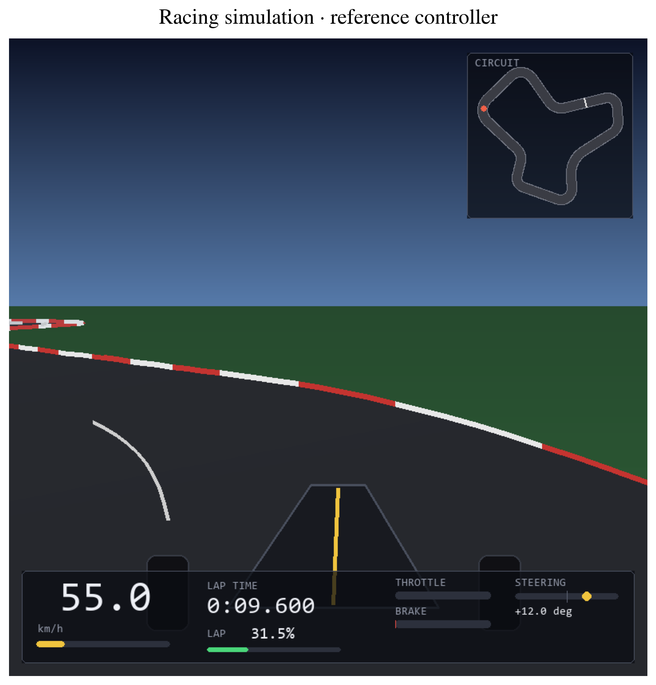

# RL Car Racing

The project presents a continuous-control racing environment with procedurally generated circuits and simplified vehicle physics.
It then describes how neural policies trained with REINFORCE, A2C+GAE, and PPO tackle the problem of finishing a lap as fast as possible.

Two experiments are run within the project:
* Experiment 1, that studies how actor-network size (tiny, small, medium, large) and training algorithm (REINFORCE, A2C, PPO) affect learning on one fixed circuit.
* Experiment 2, that compares Frenet coordinates with LiDAR observations on unseen, randomly generated circuits.



## Presentation notebooks

To get a better idea of the modelled problem and the results, you can read these three notebooks in order:

1. [Problem formalization](01-problem-formalization.ipynb): circuits, observations,
   dynamics, rewards, policies, and learning algorithms.
2. [Experiment 1](02-experiment-1.ipynb): actor-size comparisons, final driving
   performance, learning efficiency, reliability, and computational cost.
3. [Experiment 2](03-experiment-2.ipynb): generalization to unseen circuits,
   Frenet versus LiDAR, paired lap-time analysis, and learned driving controls.

## Project Overview (Project ID: PG-4):

**Main Focus**: 
Policy gradient, deep neural policies

**Scientific Objective**: 
Understand the impact of the complexity of the policy space on the performance of the agent and the amount of interactions needed to converge.

**Problem Description**: 
You want to control an autonomous Formula 1 car so that it completes a circuit in the shortest time possible. 
The car has access to its position (relative to the circuit) and velocity. 
It controls the acceleration and the steering wheel. It should be heavily penalized for going off track.

**Tasks**:
1. Choose/design a circuit (e.g. The Circuit de Monaco) and model the problem as an MDP with continuous actions. Think carefully about how to model the circuit and the relative position of the car. You are allowed to include in the state additional information about the specific circuit you are trying to solve, such as landmarks or information about the curvature, if you think this is helpful.
2. Define a reward function that encourages the agent to complete the circuit in the shortest time possible without going off track.
3. Define a parametric policy (Gaussian or deterministic) that maps states to actions (or mean actions) using a deep neural network (e.g. a fully connected neural network a.k.a. multi-layer perceptron). Implement it so that you can easily try neural networks of different sizes (number of layers and width of the layers).
4. Train your agent using a deep RL algorithm of your choice and compare the results obtained with policy networks of different sizes, in terms of:
    - Final performance
    - Number of training episodes needed to converge
    - Time needed to converge (this is machine dependent so make sure to run all experiments on the same computer)

**Challenging Variants**:
Try to learn a policy that can solve multiple circuits, in particular circuits not seen during training. You may want to train it on multiple, diverse circuits.

## Repository structure

```text
.
|-- 01-problem-formalization.ipynb  # Presentation: environment and learning
|-- 02-experiment-1.ipynb          # Presentation: actor-network size study
|-- 03-experiment-2.ipynb          # Presentation: generalization and observations
|-- src/                          # Project implementation
|   |-- agents/
|   |   |-- implementations/      # REINFORCE, A2C+GAE, and PPO agents
|   |   `-- models/               # MLPs, actors, critics, and reference policies
|   |-- configs/                  # Environment, algorithm, and experiment settings
|   |-- envs/
|   |   |-- geometry/             # Angles, interpolation, and spatial projection
|   |   |-- observations/         # Frenet and LiDAR observations
|   |   |-- racing/               # Gymnasium environment and episode lifecycle
|   |   |   `-- rendering/        # Minimal and broadcast Pygame views
|   |   |-- tracks/               # Track generation, geometry, validation, and I/O
|   |   |-- vehicle/              # Vehicle state, controls, and physics
|   |   `-- types.py              # Shared numerical types
|   |-- evaluation/               # Deterministic evaluation and scheduling
|   |-- recording/                # Run directories, metadata, and metric records
|   |-- training/
|   |   |-- engines/              # Training loops for each algorithm
|   |   |-- multienvs/            # Parallel environments and rollout collection
|   |   `-- *.py                  # Buffers, checkpoints, and timing
|   |-- utils/                    # Analysis, plotting, statistics, and seeding
|   |-- circuits.py               # Circuit splits and reproducible schedules
|   `-- normalization.py          # Running observation normalization
|-- experiments/                  # Training, calibration, analysis, and demo scripts
|   `-- notebooks/                # Utilities for the algorithm walkthroughs
|-- notebooks/                    # Runnable studies and algorithm walkthroughs
|   |-- experiment_1.ipynb
|   |-- experiment_2.ipynb
|   |-- reinforce.ipynb
|   |-- a2c.ipynb
|   `-- ppo.ipynb
|-- tracks/                       # Fixed circuit and held-out split specification
|-- results/
|   |-- reported_experiments/     # Recorded runs, including historical studies
|   |-- analysis/                 # Processed evidence, figures, and provenance
|   |-- pre_experiment_configuration/  # Calibration evidence
|   `-- reduced_budget_end_to_end_validation/  # Short validation runs
|-- docs/
|   |-- MDP.md                    # State, dynamics, lifecycle, and reward specification
|   |-- TRACK.md                  # Circuit generation and observation geometry
|   |-- LEARNING.md               # Policy, target, and loss equations
|   |-- EXPERIMENT.md             # Experimental protocol
|   |-- EXPERIMENT_1.md            # Detailed fixed-circuit results
|   |-- EXPERIMENT_2.md            # Detailed generalization results
|   |-- DIARY.md                  # Development history
|   |-- figures/                  # Report and presentation images
|   |-- tables/                   # Supporting tables and presentation statistics
|   |-- theory/                   # Course theory notes
|   `-- old-plans/                # Archived development plans and reviews
|-- tests/                        # Tests for the environment and learning system
|   `-- fixtures/                 # Small tracks and recorded-run examples
|-- .github/workflows/ci.yml       # Automated project checks
|-- pyproject.toml                # Package and development-tool configuration
|-- requirements.txt              # Project dependencies
|-- AGENTS.md                     # Project context and development conventions
|-- TODO.md                       # Experiment follow-up notes
`-- README.md                     # This guide
```

The root notebooks present the finished work; `notebooks/` contains the runnable
studies and algorithm walkthroughs. Local `.venv/`, `outputs/`, caches, and
package-installation metadata are generated working files.
