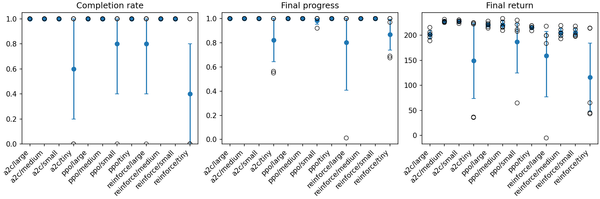
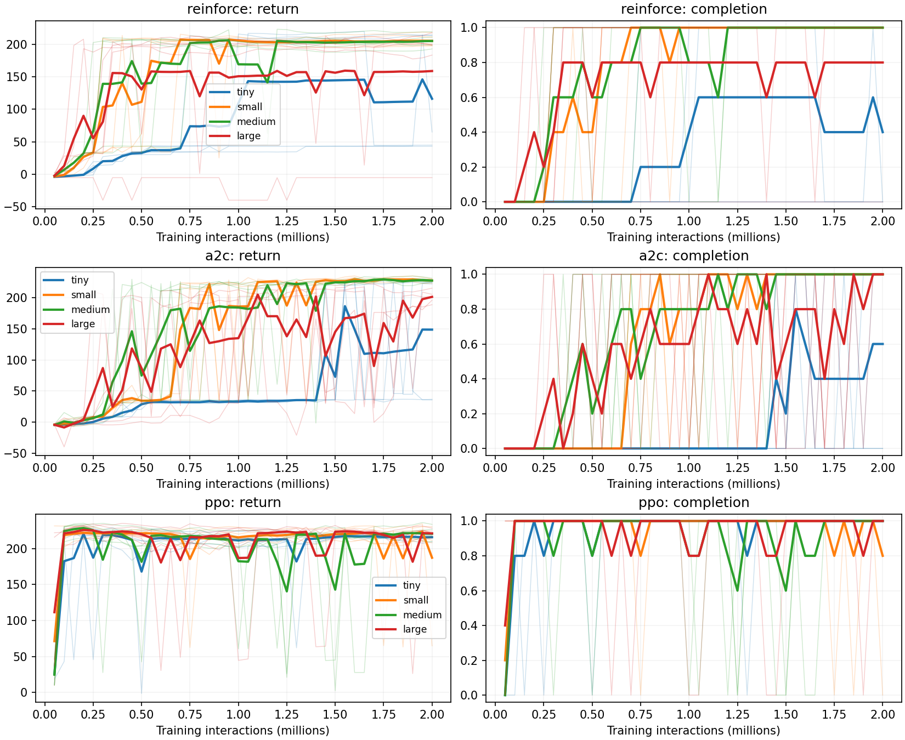
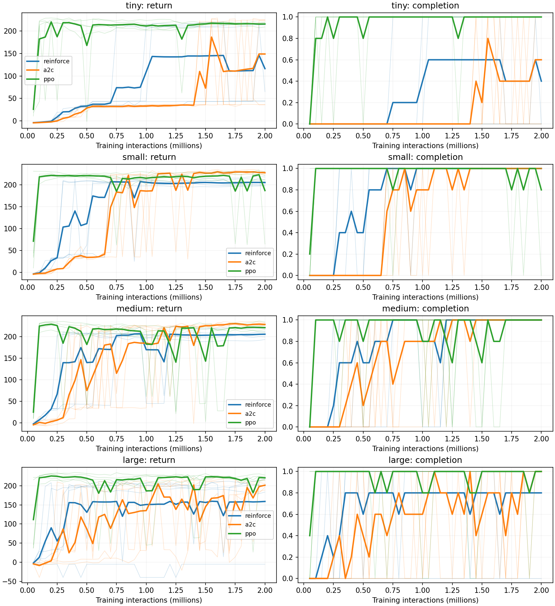
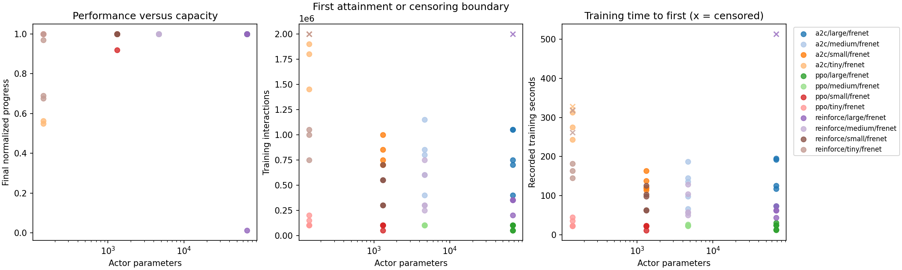
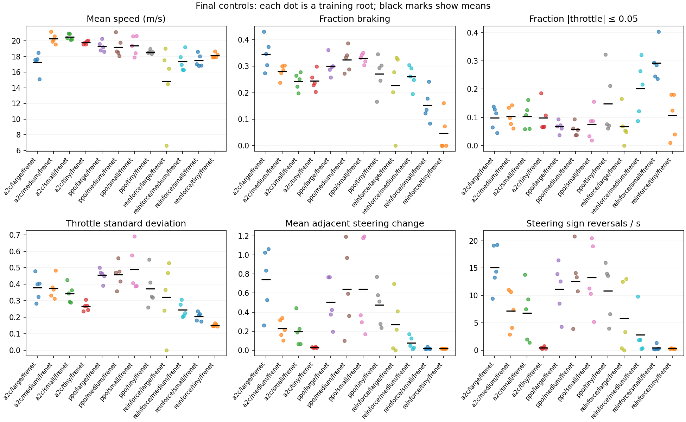
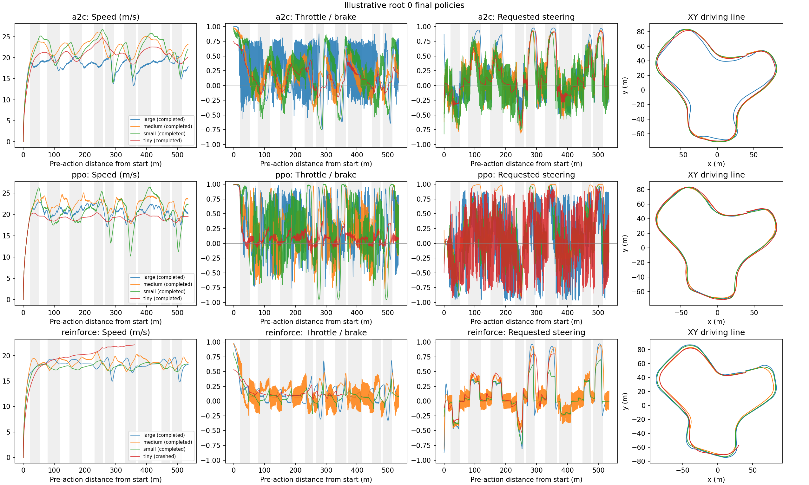
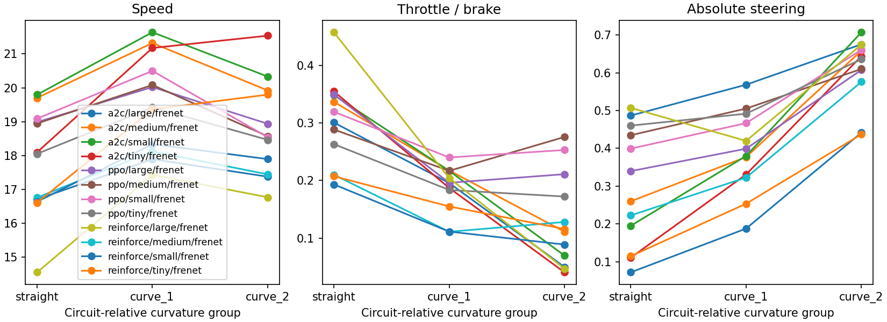

# Experiment 1 — Actor size on one circuit

**Status:** 60 completed training runs; 2 million training interactions per run.
The final deterministic policies complete 53 of 60 laps. This report analyzes
all four actor sizes together, using the evidence available on 2026-09-15.

## Main findings

Actor size matters, but its effect depends on the learning algorithm and the
interaction budget. Increasing width does not produce a consistent improvement.

- **A very small actor can solve this circuit.** PPO with only 140 actor
  parameters completes all five final evaluations, with a mean lap of 27.62 s.
  The same architecture completes only 2/5 laps with REINFORCE and 3/5 with A2C.
- **A2C with small or medium actors gives the fastest final laps:** approximately
  24.9 s, with 5/5 completions and low variation across roots. Its large actor
  also completes 5/5 final laps, but takes 30.74 s and is less stable late in training.
- **PPO reaches the task threshold first**, in both interactions and recorded
  training time. Its greater optimization cost makes a full 2M-interaction run
  more expensive; that does not make it slower to reach the threshold.
- **First attainment and final reliability differ.** A qualifying streak can be
  followed by failures. Both the final checkpoint and the fixed late-training
  window remain part of the comparison.
- **The policies learn different control patterns.** Throttle/brake variation
  and steering reversals are measurable across all roots. These describe the
  behaviour; they do not establish why one training method outperforms another.

## 1. Question and experimental design

> How does policy-network size affect final driving performance, interactions
> and episodes needed to learn, training time, and reliability on one circuit?

The study crosses three project-owned policy-gradient algorithms with four
actor widths. Each condition has five training roots, numbered `0..4`.
A root is the seed identity from which separate initialization, action,
reset and optimization random streams are derived. Comparisons pair the same
root identities, although different policies produce different trajectories.

### Task and observations

The environment is a deterministic, grip-limited bicycle model with drag and a
steering-rate limit. Two normalized actions request throttle/brake and steering.
Each interaction advances 0.04 simulated seconds; the episode deadline is 40 s.
Training randomizes the starting position, lateral offset, heading and speed.
Evaluation starts at the canonical line at zero speed.

The saved [circuit](../tracks/experiment_1.json) has 1,070 centerline samples and
is approximately 535 m long; **58.9% of its centerline samples are straight**.
The five Frenet inputs are lateral distance, heading error, speed, wheel angle
and preview curvature. They are a compact observation, not the complete state:
episode clock and lifecycle history are omitted.

The reward encourages progress and quick completion. Ordinary steps receive
100 times normalized progress minus elapsed-time cost; completion supplies a
100-point reward plus up to 140 points for unused episode time. A crash ends
the lap with a penalty of 5 and forfeits its completion reward. Consequently,
return measures both reliability and speed. For a successful lap of duration
`T` seconds, the coefficients give approximately `340 - 4.5T` total return;
terminal-step accounting introduces a small difference. See the
[MDP specification](MDP.md) for the exact rules.

### Networks and learning settings

Actors have two fully connected hidden layers with `Tanh` activations,
a two-dimensional Gaussian mean output, and two learned state-independent log
standard deviations. Training samples the Gaussian and applies `tanh` to bound
the actions. Evaluation uses `tanh(mean)` with frozen observation normalization.
The reported controls therefore contain no sampled evaluation noise.

| Actor | Hidden widths | Actor parameters | Fixed critic, A2C/PPO | Total, A2C/PPO |
|---|---|---:|---:|---:|
| Tiny | `(8, 8)` | 140 | 4,609 | 4,749 |
| Small | `(32, 32)` | 1,316 | 4,609 | 5,925 |
| Medium | `(64, 64)` | 4,676 | 4,609 | 9,285 |
| Large | `(256, 256)` | 67,844 | 4,609 | 72,453 |

REINFORCE has no critic. The actor ladder spans approximately 485 times in
parameter count, but A2C/PPO total parameters span only about 15 times because
the critic stays fixed. The critic exceeds the tiny and small actor counts;
it is slightly smaller than the medium actor.

| Algorithm | Actor learning rate | Critic learning rate | Collection and update recipe |
|---|---:|---:|---|
| REINFORCE | `1e-3` | — | Eight complete episodes per update; Monte Carlo returns |
| A2C+GAE | `1e-3` | `3e-3` | 2,048 transitions per rollout; GAE; one update |
| PPO | `3e-4` | `1e-2` | 2,048 transitions; minibatches of 64; up to four epochs |

Discount is 1.0; GAE lambda is 0.95. PPO uses clip epsilon 0.2 and target KL
0.02. Adam, initialization, normalization and log-scale bounds `[-5, 0]`
are fixed across sizes. Learning rates were selected on the medium actor,
then reused. This measures architecture performance **under one recipe per
algorithm**, rather than each size's best performance after independent tuning.
The [learning contract](LEARNING.md) specifies estimators and losses.

**Timeout limitation.** REINFORCE ends its Monte Carlo return at the task
deadline; A2C/PPO bootstrap once from the critic there. This retained mismatch
limits comparisons between algorithms. It does not vary between actor sizes.

Each run receives exactly 2M training interactions, excluding evaluation.
Evaluation occurs every 50k; checkpoints are saved every 250k and at the end.
Runs execute sequentially on the experiment machine, using CPU PyTorch, eight
environment workers, and one intra/inter-op Torch thread. The 60 recorded
end-to-end durations sum to **396.2 minutes**.

## 2. How to read the evidence

Final outcomes use the 2M checkpoint, without choosing the best earlier policy.
Return and progress average all five roots, including crashes. Lap times average
only completed laps and must be read with their completion denominator.
Progress is the maximum normalized distance reached during the episode; small
finish-line overshoots in the recorder round to 1.000.

The sample standard deviation (SD) describes variation across training roots.
95% intervals for means use all `5^5 = 3,125` ordered bootstrap resamples of the
five roots. Paired intervals resample the five within-root differences.
Exhaustive enumeration removes resampling randomness; it does **not** make
inferential coverage exact with five roots. Shared seeds preserve a designed
pairing, but do not guarantee cancellation of training variation. The many
size/algorithm contrasts are exploratory and are not adjusted for multiplicity.
An interval containing zero does not establish equivalence.

Three distinct learning outcomes are retained:

1. **First threshold attainment:** the first checkpoint in a streak of three
   consecutive evaluations that each complete the lap in at most **34 s**.
2. **Confirmation cost:** recorded interactions, completed training episodes
   and training duration at the third checkpoint, 100k interactions later.
3. **Late stability:** mean completion over the eight evaluations at
   `1.65M, 1.70M, ..., 2.00M`, satisfying `0.8B < t <= B`.

A run without a confirmed streak is right-censored at 2M: its threshold time
is unknown within the budget. Means of observed attainment costs below include
only qualifying roots, with the denominator explicit. The 34-second allowance
is approximately 1.5 times the reference controller's 22.3-second average. A final or late
completion need not satisfy the stricter 34-second criterion.

**Correction to the processed convergence summaries.** The supplied analysis
code used a 100-second lap cutoff, effectively accepting any completed lap
within this environment's deadline. Reapplying the protocol's 34-second rule to
`evaluation_outcomes.json` changes REINFORCE-large root 3 from 300k to **350k**
and A2C-large root 4 from 550k to **700k**. Confirmation boundaries, episode
counts and recorded durations have been recomputed accordingly. All other
first-attainment boundaries and all final outcomes are unchanged. The
[60-root threshold table](tables/experiment_1_thresholds.csv) and threshold
figure in this report use the corrected rule; the supplied processed files
and training implementation remain unchanged.

## 3. Final performance at two million interactions

| Algorithm | Actor | Completed laps | Return mean ± SD | Return 95% interval | Progress | Lap time (s), completed only |
|---|---|---:|---:|---|---:|---:|
| REINFORCE | Tiny | 2/5 | 116.30 ± 89.81 | [48.21, 184.39] | 0.867 | 27.94 |
| REINFORCE | Small | 5/5 | 205.49 ± 9.05 | [198.78, 213.02] | 1.000 | 29.88 |
| REINFORCE | Medium | 5/5 | 205.31 ± 10.34 | [197.60, 213.73] | 1.000 | 29.92 |
| REINFORCE | Large | 4/5 | 159.06 ± 92.65 | [76.63, 207.43] | 0.803 | 31.08 |
| A2C | Tiny | 3/5 | 148.88 ± 102.94 | [73.38, 224.38] | 0.823 | 25.76 |
| A2C | Small | 5/5 | 227.84 ± 2.92 | [225.53, 229.97] | 1.000 | 24.91 |
| A2C | Medium | 5/5 | 227.98 ± 2.40 | [226.37, 230.00] | 1.000 | 24.90 |
| A2C | Large | 5/5 | 201.67 ± 10.02 | [194.06, 209.79] | 1.000 | 30.74 |
| PPO | Tiny | 5/5 | 215.70 ± 4.10 | [212.33, 218.44] | 1.000 | 27.62 |
| PPO | Small | 4/5 | 187.15 ± 69.00 | [124.72, 223.33] | 0.984 | 27.16 |
| PPO | Medium | 5/5 | 220.61 ± 9.42 | [213.69, 228.58] | 1.000 | 26.52 |
| PPO | Large | 5/5 | 220.97 ± 5.51 | [216.77, 225.17] | 1.000 | 26.45 |

### Size effects within each algorithm

**REINFORCE benefits from moving beyond tiny, but not consistently beyond small.**
Small and medium both complete every final lap, at nearly the same observed
mean lap time. Tiny loses three roots and large loses one. Tiny's successful
laps are faster than small's, but this conditional result omits most of tiny's
roots and does not make it the better condition. Its high mean progress also
shows why progress alone is insufficient: approaching the finish is not finishing.

**A2C has its strongest outcomes at small and medium.** Their observed lap
means are close, and both have low return SD. Large is 5.84 s slower than
medium, about 23% longer, despite completing all final laps. Tiny's three
successful roots drive fairly quickly, but two final crashes and very late
attainment lower its practical performance.

**PPO can learn with very little actor capacity on this task.** Tiny completes
all roots, with return only 4.91 points below medium and a 1.09 s longer mean
lap. This demonstrates representational sufficiency for successful driving on
this circuit with this observation. It does not establish sufficiency for every
circuit, optimal racing, or every algorithm. Medium and large have close observed
endpoints. Small's final crash remains a real outcome of the trained checkpoint,
even though its earlier performance is good.

Selected paired size contrasts make uncertainty explicit. Positive differences
favour the first named size; the full set is linked at the end.

| Algorithm | Size contrast | Mean return difference | 95% interval |
|---|---|---:|---|
| REINFORCE | Tiny − Small | -89.18 | [-151.21, -27.16] |
| REINFORCE | Small − Medium | +0.17 | [-12.63, 12.98] |
| REINFORCE | Medium − Large | +46.26 | [-2.13, 127.23] |
| A2C | Tiny − Small | -78.96 | [-154.52, -3.59] |
| A2C | Tiny − Medium | -79.09 | [-154.99, -3.20] |
| A2C | Small − Medium | -0.13 | [-3.35, 3.02] |
| A2C | Medium − Large | +26.31 | [18.72, 32.39] |
| PPO | Tiny − Medium | -4.91 | [-11.67, 0.71] |
| PPO | Tiny − Large | -5.27 | [-11.54, 1.00] |
| PPO | Small − Medium | -33.47 | [-92.69, 0.21] |
| PPO | Medium − Large | -0.36 | [-9.18, 8.46] |

The expanded ladder supports neither “capacity has no effect” nor “larger is
worse.” Tiny-to-small helps REINFORCE and A2C substantially; medium-to-large
hurts A2C. Similar endpoints elsewhere are compatible with a range of effects
and learning histories.

### Algorithms at a fixed size

| Actor | A2C − PPO return [95% interval] | REINFORCE − A2C return [95% interval] | REINFORCE − PPO return [95% interval] |
|---|---|---|---|
| Tiny | -66.82 [-141.01, 6.73] | -32.58 [-146.38, 81.22] | -99.40 [-168.80, -30.00] |
| Small | +40.69 [3.59, 104.23] | -22.35 [-29.79, -14.92] | +18.34 [-22.88, 87.60] |
| Medium | +7.36 [0.89, 13.79] | -22.66 [-30.24, -13.46] | -15.30 [-19.69, -10.33] |
| Large | -19.31 [-24.89, -12.05] | -42.61 [-126.68, 11.61] | -61.92 [-149.90, -9.99] |

At tiny, PPO gives the best observed combination of speed and completion. At
small and medium, A2C finishes fastest; at large, PPO has the highest return.
The wide small-actor A2C–PPO contrast includes the cost of PPO's failed root.
These algorithm-by-size patterns describe different responses to width, but
do not isolate the causes: learning rates, estimators and update schedules
differ together.

## 4. Learning efficiency and later stability

*Thin curves retain individual roots; thick curves are condition means.
Completion is distinct from the 34-second threshold.*

### Common interaction budgets

Each entry is **mean return (completed roots / 5)** at that exact evaluation.
These checkpoints compare policies during the same runs, not independently
trained short-budget experiments.

| Algorithm / actor | 250k | 500k | 750k | 1M | 2M |
|---|---|---|---|---|---|
| REINFORCE / Tiny | 8.6 (0/5) | 32.9 (0/5) | 74.0 (1/5) | 109.2 (2/5) | 116.3 (2/5) |
| REINFORCE / Small | 33.5 (0/5) | 111.6 (2/5) | 207.0 (5/5) | 206.1 (5/5) | 205.5 (5/5) |
| REINFORCE / Medium | 66.5 (1/5) | 139.6 (3/5) | 202.1 (5/5) | 169.4 (4/5) | 205.3 (5/5) |
| REINFORCE / Large | 55.5 (1/5) | 130.5 (3/5) | 159.0 (4/5) | 151.0 (4/5) | 159.1 (4/5) |
| A2C / Tiny | 0.2 (0/5) | 28.6 (0/5) | 32.0 (0/5) | 33.0 (0/5) | 148.9 (3/5) |
| A2C / Small | 7.9 (0/5) | 34.2 (0/5) | 183.8 (4/5) | 186.0 (4/5) | 227.8 (5/5) |
| A2C / Medium | 6.2 (0/5) | 74.8 (1/5) | 114.7 (2/5) | 184.5 (4/5) | 228.0 (5/5) |
| A2C / Large | 44.3 (1/5) | 86.6 (2/5) | 126.4 (3/5) | 135.1 (3/5) | 201.7 (5/5) |
| PPO / Tiny | 187.2 (4/5) | 167.9 (4/5) | 213.7 (5/5) | 211.1 (5/5) | 215.7 (5/5) |
| PPO / Small | 221.2 (5/5) | 221.2 (5/5) | 185.4 (4/5) | 215.4 (5/5) | 187.1 (4/5) |
| PPO / Medium | 225.3 (5/5) | 181.5 (4/5) | 217.2 (5/5) | 182.3 (4/5) | 220.6 (5/5) |
| PPO / Large | 224.9 (5/5) | 219.7 (5/5) | 215.9 (5/5) | 186.8 (4/5) | 221.0 (5/5) |

At 250k, PPO leads at every size. At 2M, A2C small and medium overtake it in
final return. A2C tiny has no completed roots even at 1M, yet three complete at
2M. The budget changes conclusions about learnability and algorithm rankings.

Within algorithms, larger actors do not simply arrive at the same result sooner.
REINFORCE small and medium settle near similar endpoints, while tiny remains
unreliable. A2C small and medium finish similarly despite different intermediate
completion histories; large remains worse, and tiny is still learning late.
PPO tiny initially trails its larger actors but later completes reliably.
Occasional PPO dips are real failed evaluations of changing checkpoints, not
noise to remove from the curves.

A summary across the curve also distinguishes early usefulness from final
quality. Normalized return area is the trapezoidal area from the first recorded
evaluation to the last, divided by that interaction span; it has return units
and is not cumulative training reward. At medium, REINFORCE/A2C/PPO score
**167.80 / 160.32 / 204.82** on this measure. PPO leads both other algorithms
in mean curve area at every size, despite losing to A2C small/medium finally.

### Threshold costs

Costs average observed attainments only. Training seconds are the recorder's
collection-plus-optimization clock, excluding evaluation, persistence and other
end-to-end overhead. Episode counts are completed training episodes by the
boundary across all eight workers, rather than a fixed amount of experience.

| Algorithm / actor | Attained | First interactions: mean; range | Episodes to first, mean | Training s to first | Training s to confirmation | Late completion |
|---|---:|---|---:|---:|---:|---:|
| REINFORCE / Tiny | 3/5 | 933k; 750k–1,050k | 3,099 | 163.3 | 177.7 | 0.450 |
| REINFORCE / Small | 5/5 | 480k; 300k–700k | 1,664 | 90.7 | 105.8 | 1.000 |
| REINFORCE / Medium | 5/5 | 440k; 250k–750k | 1,317 | 79.5 | 94.1 | 1.000 |
| REINFORCE / Large | 4/5 | 313k; 200k–350k | 1,100 | 60.5 | 76.2 | 0.775 |
| A2C / Tiny | 3/5 | 1,717k; 1,450k–1,900k | 4,610 | 277.1 | 292.9 | 0.450 |
| A2C / Small | 5/5 | 800k; 700k–1,000k | 2,544 | 131.2 | 147.5 | 1.000 |
| A2C / Medium | 5/5 | 760k; 400k–1,150k | 2,951 | 126.6 | 143.1 | 1.000 |
| A2C / Large | 5/5 | 790k; 400k–1,050k | 5,239 | 140.9 | 157.8 | 0.800 |
| PPO / Tiny | 5/5 | 130k; 100k–200k | 352 | 29.9 | 52.7 | 1.000 |
| PPO / Small | 5/5 | 90k; 50k–100k | 300 | 20.5 | 43.0 | 0.925 |
| PPO / Medium | 5/5 | 100k; 100k–100k | 336 | 24.2 | 48.2 | 0.975 |
| PPO / Large | 5/5 | 80k; 50k–100k | 245 | 21.4 | 48.4 | 0.975 |

Confirmation interactions are each first boundary plus 100k. The linked
threshold CSV supplies both episode counts and both recorded times for every
root, with blanks for censored outcomes.

*Crosses mark censoring boundaries, not observed attainment times.*

PPO's mean first-attainment time is 20.5–29.9 training seconds across sizes;
confirmation takes 43.0–52.7 s. At medium, it confirms in 48.2 s compared with
94.1 s for REINFORCE and 143.1 s for A2C. The 50k evaluation spacing limits
fine comparisons among early PPO arrivals, while the extra 100k needed to
confirm the streak is substantial relative to its first boundary.

REINFORCE large's low conditional attainment cost must be read beside its
censored root. A2C large reaches the threshold in a similar interaction range
to small/medium, but has more completed episodes at first attainment and worse
late stability. Episode counts alone cannot establish efficiency because
shorter episodes contribute fewer transitions.

### Failures and regressions

All 60 training jobs finish their budgets; seven final driving evaluations
crash. These are task failures, not failed execution jobs.

| Condition / roots | Recorded behaviour |
|---|---|
| REINFORCE Tiny, 0 and 2 | No qualifying three-checkpoint streak; both crash finally. Root 2 does have an isolated late completion. |
| REINFORCE Tiny, 4 | First qualifies at 1.05M, but completes only 1/8 late evaluations and crashes finally. |
| A2C Tiny, 2 and 3 | No qualifying streak; both crash finally. Root 3 completes 2/8 late evaluations, so censoring does not mean it never finishes any lap. |
| REINFORCE Large, 2 | Never reaches the threshold and ends near the start, with final return -5.24. |
| PPO Small, 1 | Qualifies at 100k, but completes only 5/8 late evaluations and crashes finally at about 0.92 progress, return 64.73. |

A2C tiny root 4 first qualifies at 1.90M, with confirmation only at the final
2M boundary. Its result is particularly incompatible with a claim that the
full budget was unnecessary. A2C large completes all five final laps but only
32/40 late evaluations. PPO tiny completes all 40 late evaluations; medium and
large each complete 39/40. These checkpoints describe the stability of continued
training and are not additional independent training roots.

A deterministic frozen policy on this deterministic circuit has a fixed
outcome. Success/failure changes between checkpoints arise while the policy
and normalization change. Calling that one frozen policy “bimodal,” or replacing
its final crash with an earlier successful result, would misstate the evidence.

## 5. What controls are learned?

### Measurement and coverage

The control analysis includes **all 60 final deterministic drives**, including
the seven crashes. Within a drive, each action step has equal weight; condition
summaries give each root equal weight. Failures contribute only the portion
actually observed, without inventing controls for the rest of the lap.

Braking means requested throttle `< 0`; near-zero throttle means absolute value
`<= 0.05`. Steering change is the mean absolute difference between consecutive
normalized requests. Reversals count sign changes after removing requests with
absolute value `<= 0.05`, divided by simulated episode duration. Near saturation
means absolute steering request `>= 0.9`.

Speed and actions are pre-action quantities. Their distance is aligned by
shifting the recorder's post-action progress by one step. A steering request,
the rate-limited wheel angle, and the grip-limited effective turning angle are
distinct: request reversals do not measure tire slip or an equal number of
physical wheel reversals.

### Whole-drive controls

The q10/median/q90 entries average each drive's own quantiles; they are not
quantiles of one pooled action stream. Throttle SD is within-drive variation,
then averaged across roots, unlike the across-root return SD above.

| Algorithm / actor | Coverage | Mean speed (m/s) | Brake fraction | Throttle q10 / median / q90 | Throttle SD | Mean steering change | Reversals/s |
|---|---:|---:|---:|---|---:|---:|---:|
| REINFORCE / Tiny | 0.867 | 18.13 | 0.047 | 0.03 / 0.12 / 0.46 | 0.15 | 0.017 | 0.29 |
| REINFORCE / Small | 1.000 | 17.47 | 0.153 | -0.03 / 0.09 / 0.40 | 0.20 | 0.019 | 0.45 |
| REINFORCE / Medium | 1.000 | 17.34 | 0.260 | -0.11 / 0.13 / 0.43 | 0.24 | 0.076 | 2.82 |
| REINFORCE / Large | 0.802 | 14.82 | 0.228 | -0.05 / 0.39 / 0.77 | 0.32 | 0.269 | 5.85 |
| A2C / Tiny | 0.823 | 19.77 | 0.245 | -0.14 / 0.25 / 0.62 | 0.27 | 0.029 | 0.44 |
| A2C / Small | 1.000 | 20.50 | 0.243 | -0.21 / 0.23 / 0.76 | 0.34 | 0.197 | 6.78 |
| A2C / Medium | 1.000 | 20.26 | 0.280 | -0.22 / 0.22 / 0.82 | 0.38 | 0.227 | 7.21 |
| A2C / Large | 1.000 | 17.24 | 0.346 | -0.24 / 0.18 / 0.70 | 0.38 | 0.743 | 15.09 |
| PPO / Tiny | 1.000 | 18.57 | 0.271 | -0.24 / 0.20 / 0.65 | 0.37 | 0.475 | 10.84 |
| PPO / Small | 0.984 | 19.38 | 0.330 | -0.39 / 0.35 / 0.93 | 0.49 | 0.642 | 13.27 |
| PPO / Medium | 1.000 | 19.21 | 0.325 | -0.34 / 0.26 / 0.93 | 0.46 | 0.644 | 12.59 |
| PPO / Large | 1.000 | 19.29 | 0.301 | -0.35 / 0.27 / 0.89 | 0.46 | 0.506 | 11.15 |

Speed distributions and steering saturation add context to the means. These
again average per-drive statistics over all five roots, including failures.

| Algorithm / actor | Speed q10 / median / q90 (m/s) | Near-saturated steering fraction |
|---|---|---:|
| REINFORCE / Tiny | 11.61 / 19.69 / 21.35 | 0.000 |
| REINFORCE / Small | 16.86 / 18.16 / 19.25 | 0.000 |
| REINFORCE / Medium | 15.76 / 18.01 / 19.59 | 0.068 |
| REINFORCE / Large | 11.37 / 15.45 / 18.30 | 0.323 |
| A2C / Tiny | 13.05 / 21.12 / 24.12 | 0.037 |
| A2C / Small | 17.69 / 21.39 / 24.38 | 0.127 |
| A2C / Medium | 17.06 / 21.11 / 24.02 | 0.082 |
| A2C / Large | 15.49 / 17.88 / 19.15 | 0.192 |
| PPO / Tiny | 16.96 / 19.29 / 21.10 | 0.156 |
| PPO / Small | 15.66 / 20.34 / 22.98 | 0.165 |
| PPO / Medium | 15.99 / 20.10 / 22.64 | 0.180 |
| PPO / Large | 16.45 / 20.12 / 22.75 | 0.067 |

**The agents do more than hold one throttle value**, but learn different amounts
and patterns of modulation. REINFORCE tiny and small have the narrowest throttle
distributions and least frequent steering reversals. Small's 15.3% braking
fraction still rules out pure constant-throttle driving. A2C and PPO usually
span appreciable positive and negative requests, with braking on roughly a
quarter to a third of steps. Positive throttle can balance drag; a low signed
mean can also hide alternating acceleration and braking.

A2C large combines lower mean speed with more braking and much more steering
variation than small/medium. This is an association with its slower laps. It
does not prove that steering changes caused the deficit, that its line is
intrinsically worse, or that extra capacity necessarily causes instability.
PPO shows frequent steering-request reversals at every size, including tiny,
which completes every final and late evaluation.

### Circuit position and curvature

*These are root 0's final policies, selected by identity rather than performance.
Grey shading marks curved portions along the first listed drive in each panel.
REINFORCE tiny's trace ends at its crash. XY panels show paths, without claiming
an optimal racing line or measuring boundary clearance.*

A2C root-0 small/medium traces show repeated acceleration and deceleration
around successive corners; the large actor's speed stays lower while its
requests fluctuate rapidly. REINFORCE's completed examples maintain a narrower
speed range after launch. PPO tiny's root-0 speed is fairly steady after launch,
even though steering requests switch frequently. Thus “steady speed” and
“constant action” are different claims. Corner approaches and exits in the
signed traces supply context that a mean over current curvature alone loses.

Straights are grouped separately using `|curvature| <= 1e-8`. Unique positive
centerline quartile edges below the maximum define the remaining groups. Here,
the only positive edge is approximately **0.0548572 m⁻¹**, giving straight,
milder-curve and tighter-curve groups, rather than four informative quartiles.
The zero quartiles come from the long straight portions.

For A2C small/medium/large, mean speeds on straight portions are
**19.79 / 19.70 / 16.70 m/s**; on tighter curves they are
**20.33 / 19.92 / 17.37 m/s**. The large-actor speed deficit appears in both
parts. Straight means include the zero-speed launch and braking before corners,
so their lower values do not imply a preference for accelerating through the
tightest turns. REINFORCE-large root 2 never visits the curved groups: those
summaries have four contributing roots, while its straight summary has five.
Missing exposure cannot be interpreted as successful or zero-speed driving
on an unvisited corner.

## 6. Computation and optimization diagnostics

### Full-budget resource cost

Per-run means; these durations are distinct from threshold costs.

| Algorithm / actor | Collection (min) | Optimization (min) | Evaluation (min) | End-to-end (min) | Collection interactions/s |
|---|---:|---:|---:|---:|---:|
| REINFORCE / Tiny | 4.81 | 0.23 | 0.08 | 5.31 | 6,964 |
| REINFORCE / Small | 5.01 | 0.25 | 0.12 | 5.57 | 6,658 |
| REINFORCE / Medium | 4.84 | 0.25 | 0.12 | 5.39 | 6,899 |
| REINFORCE / Large | 5.71 | 0.50 | 0.11 | 6.75 | 6,012 |
| A2C / Tiny | 4.99 | 0.39 | 0.07 | 5.63 | 6,680 |
| A2C / Small | 5.03 | 0.40 | 0.09 | 5.70 | 6,626 |
| A2C / Medium | 5.07 | 0.42 | 0.09 | 5.77 | 6,581 |
| A2C / Large | 5.09 | 0.68 | 0.10 | 6.10 | 6,566 |
| PPO / Tiny | 4.90 | 2.82 | 0.12 | 7.99 | 6,805 |
| PPO / Small | 4.70 | 2.85 | 0.11 | 7.82 | 7,102 |
| PPO / Medium | 4.99 | 2.96 | 0.12 | 8.23 | 6,680 |
| PPO / Large | 5.02 | 3.69 | 0.12 | 8.98 | 6,648 |

Collection is the largest measured category. PPO's repeated minibatch updates
make optimization more expensive than A2C's or REINFORCE's. Nevertheless,
shrinking PPO from medium to tiny reduces end-to-end time only from 8.23 to
7.99 minutes: the fixed critic, environment work and update schedule remain.
Parameter reduction is not proportional to training speedup. Small timing
differences also include execution variation; tiny runs were collected in a
separate execution batch.

End-to-end duration includes persistence and other orchestration overhead,
so the listed components need not sum to that column. Peak memory is a
main-process lifetime high-water mark, excludes workers and can carry over
between sequential runs. It cannot support architecture-specific whole-job
memory comparisons here.

### What the diagnostics establish

Diagnostics average the final tenth of each run's optimizer updates, then
weight roots equally. The [optimization figure](figures/experiment_1/optimization_diagnostics.png)
provides per-condition context.

| Algorithm | Tiny explained variance | Small | Medium | Large |
|---|---:|---:|---:|---:|
| A2C | 0.009 | -0.077 | -0.074 | -0.063 |
| PPO | 0.036 | 0.134 | 0.087 | 0.122 |

Low explained variance against logged value targets coexists with successful
driving. It does not establish that critic accuracy is irrelevant, or measure
how much the baseline reduces gradient variance. GAE with lambda below one
uses bootstrapped values, so critic errors can affect advantages.

PPO's mean log scales lie near their upper bound, approximately -0.002 to
-0.001 across sizes and actions, versus roughly -0.68 to -0.50 for A2C and
REINFORCE. Its pre-squash Gaussian scale therefore approaches 1. This differs
from bounded-action variation after `tanh`; no noise is sampled in deterministic
evaluation. A constrained solution can lie on a boundary. These observations
do not show that changing the bound would improve performance or eliminate
control oscillations.

PPO's approximate KL increases from 0.0020 at tiny to 0.0076 at large; its clip
fraction increases from 0.018 to 0.096. Averages below the 0.02 KL target do not
count how often individual updates triggered early stopping. Raw actor-gradient
norms also differ across algorithms and sizes. Their dimensions and loss
reductions differ, and a shared gradient clipping threshold does not imply
identical Adam parameter updates.

## 7. Answers to the study questions

**Are the sizes informative?** Yes. The ladder includes a regime where
REINFORCE and A2C learn slowly or unreliably, alongside a PPO actor small enough
to show that this circuit does not demand thousands of actor parameters merely
to finish. The experiment does not locate a universal minimum network size.

**Do sizes even out with enough training?** Some endpoints become close, notably
small/medium REINFORCE and A2C, but intermediate outcomes differ. Tiny A2C and
REINFORCE remain unreliable at 2M, and large A2C remains slower. These data do
not show what an arbitrarily longer budget would do.

**Which configuration is preferable?** Under this protocol, small A2C offers
fast final laps with 5/5 completions and fewer actor parameters than medium.
For early threshold attainment, PPO is strongest; tiny PPO is a compact option
with good observed late reliability and a modest speed deficit relative to
medium/large. These are different criteria, not one universal ranking.

**Would more roots help?** Five roots leave reliability uncertain: one failure
moves completion by 20 percentage points. Large SDs caused by failed roots are
part of the reliability distribution, not disposable outliers. Additional
independent training roots would strengthen comparisons, especially for tiny
actors and PPO small. More identical evaluations of a frozen policy would not
replace those roots.

**What explains the algorithm differences?** The study establishes different
responses to width and distinct control patterns. It does not identify whether
these arise from representation, optimization, exploration, value targets or
their interactions. Fixed learning rates and multiple algorithmic differences
prevent that causal attribution.

### Connection to Experiment 2

Experiment 2 keeps **medium PPO**, selected before the tiny study from the
original small/medium/large candidates. Large's mean return was highest; medium
had a paired deficit of 0.36 with SE 4.96 and satisfied the one-SE admission rule.
Small's deficit was 33.83 with SE 30.26, so it failed the return criterion.
Its 4/5 completions did satisfy the separate within-one-root completion rule.
The tiny result does not retrospectively alter this fixed selection; the
[original selection artifact](../results/analysis/reported_experiments/experiment_1/ppo_actor_selection.json)
remains the reference.

## 8. Scope and evidence sources

The conclusions concern one generated circuit, two-layer feed-forward actors,
five roots per condition, canonical deterministic evaluation, and the specified
recipe. They do not establish optimal racing, stochastic deployment performance,
depth effects, or real Formula 1 behaviour. Actor capacity varies while critic
capacity stays fixed. The timeout mismatch and medium-based learning-rate
calibration limit algorithm-wide conclusions.

The 60 runs comprise 45 small/medium/large runs and 15 tiny runs under the same
controlled settings. Raw inputs are under
`results/reported_experiments/experiment_1/` and `experiment_1_extension/`.
The analysis directory is
`results/analysis/reported_experiments/experiment_1_combined/`.

- [Protocol](EXPERIMENT.md) and [results index](../results/README.md).
- [Analysis manifest](../results/analysis/reported_experiments/experiment_1_combined/analysis_manifest.json): input checksums, bootstrap, control and plotting conventions.
- [Run inventory](../results/analysis/reported_experiments/experiment_1_combined/run_inventory.json): configurations, recorded code identity, dependencies and execution metadata.
- [Final cell summaries](../results/analysis/reported_experiments/experiment_1_combined/cell_summaries.csv), [all paired contrasts](../results/analysis/reported_experiments/experiment_1_combined/paired_summaries.csv), and [common-budget outcomes](../results/analysis/reported_experiments/experiment_1_combined/common_budget_outcomes.csv).
- [Corrected threshold table](tables/experiment_1_thresholds.csv): source run checksums, original processed boundary, 34-second first/confirmation boundaries, completed episodes and training seconds. Derived by sorting each run's evaluations by interactions, finding the first qualifying three-row streak, and counting recorded training episodes through each boundary.
- [Final controls by root](../results/analysis/reported_experiments/experiment_1_combined/root_controls.csv) and [curvature groups](../results/analysis/reported_experiments/experiment_1_combined/curvature_controls.csv).
- [Combined return/progress curves](figures/experiment_1/learning_curves.png) supplement the separated comparisons above.

The run inventory records dirty working trees for the Experiment 1 training
snapshots; a commit identifier alone does not reproduce their full source state.
Keep recorded configuration, dependency and data provenance with the results.
Figures are retained under `docs/figures/experiment_1/` so the report remains
viewable without the locally stored raw runs.
