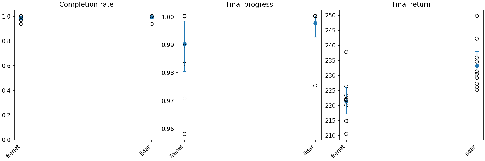
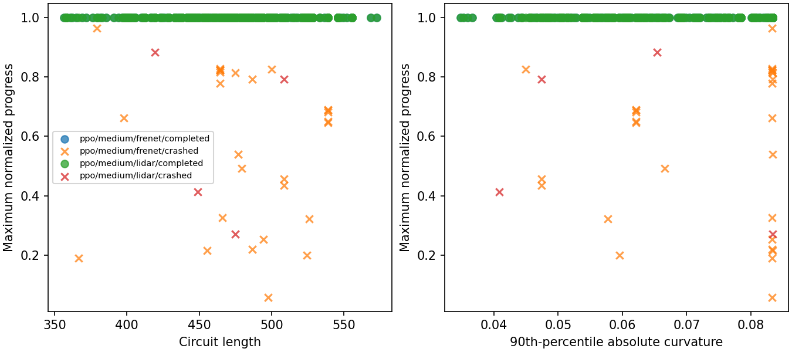
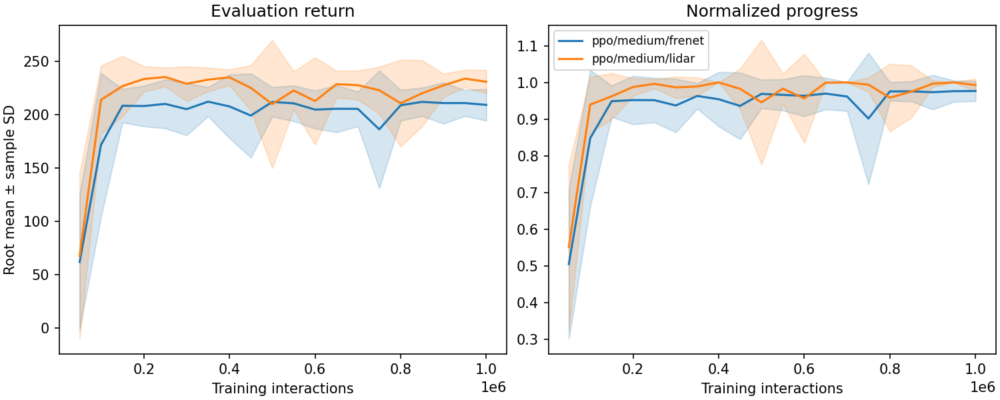
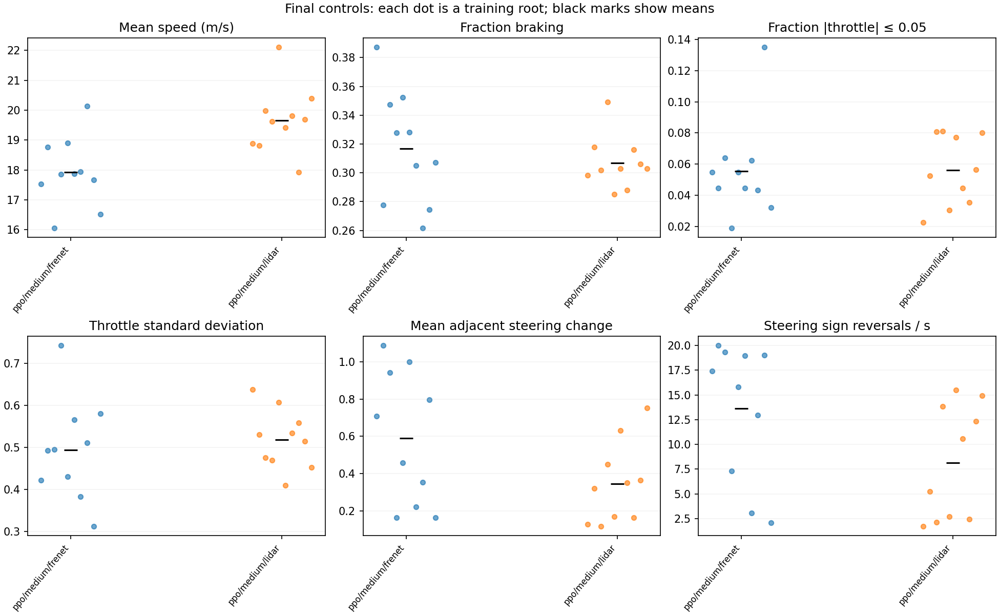
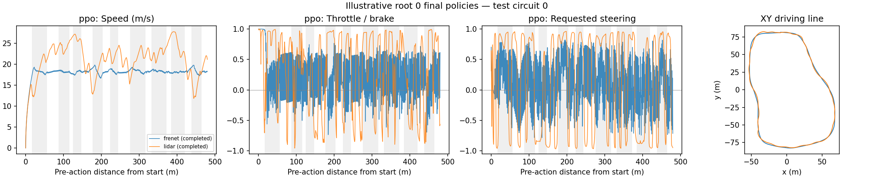
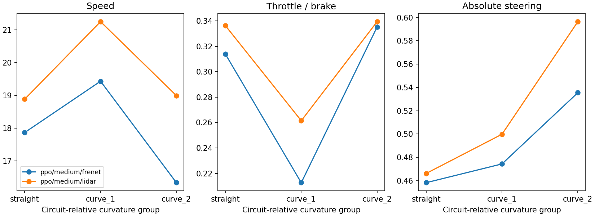
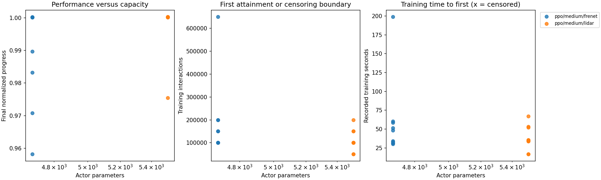
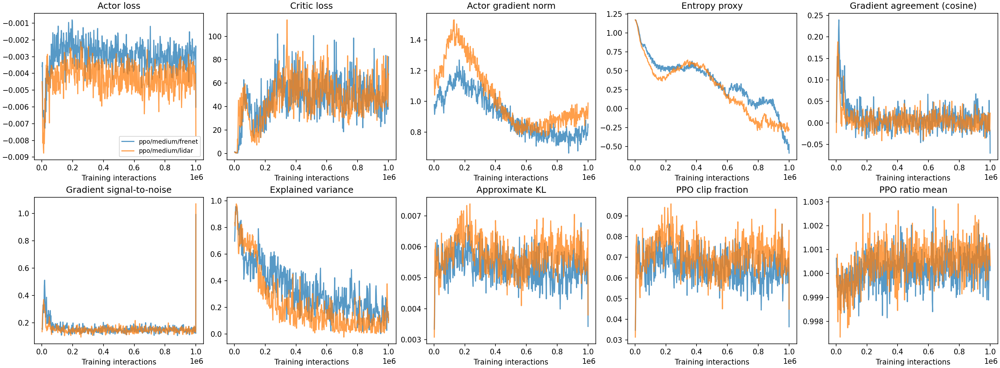

# Experiment 2 — Circuit generalization and observation choice

**Status:** 20 completed training runs; ten paired roots; 1 million training
interactions per run. Each final policy is evaluated on the same 32 test
circuits. This report uses only the twenty runs in `experiment_2_revised`, with
evidence available on 2026-09-15.

## Main findings

Both observation types support strong driving performance on unseen circuits
from the training generator. **LiDAR has higher final return and faster laps;
the small completion-rate difference remains uncertain.**

- Frenet completes **315/320** test evaluations (98.44%); LiDAR completes
  **318/320** (99.38%). These are repeated evaluations of ten policies per
  condition on 32 circuits, not 320 independent trained agents.
- LiDAR's mean test return is **233.21**, versus **221.36** for Frenet. The
  paired LiDAR advantage is 11.85 return points; the 95% root-bootstrap
  interval is **[4.59, 18.78]**.
- Completed laps average **23.45 s with LiDAR** and **25.64 s with Frenet**.
  Matching only circuits that both policies complete retains an average LiDAR
  advantage of **2.21 s** across roots.
- All twenty runs reach the validation threshold. LiDAR has earlier attainment
  on average and higher late validation completion, but the paired interval
  for time to first attainment includes zero. Learning is not permanently stable
  after the first successful streak.
- LiDAR takes **6.79 minutes per full run**, versus **5.88** for Frenet. Its
  higher full-budget cost coexists with earlier average threshold attainment.

## 1. Questions and controlled design

> **RQ2:** Can PPO trained on generated circuits drive unseen circuits?
>
> **RQ3:** How do compact Frenet observations compare with local LiDAR sensing
> in final performance, learning efficiency, stability and learned controls?

The task is to complete a circuit quickly while staying within its boundaries.
The simulator uses deterministic grip-limited bicycle dynamics, drag and a
steering-rate limit. Actions request normalized throttle/brake and steering.
One training interaction advances 0.04 simulated seconds; an episode lasts at
most 40 s. Training samples randomized start poses, while deterministic
evaluation starts at each circuit's canonical line at zero speed.

Reward combines progress, elapsed-time cost and a completion bonus that increases
with unused episode time. An ordinary step receives 100 times normalized progress
minus time cost; completion pays 100 plus up to 140 for unused time. A crash
ends the episode with a penalty of 5 and forfeits the finish bonus. Return is
therefore sensitive to both crashes and lap duration; completed-lap time measures
speed conditional on success. The [MDP specification](MDP.md) gives exact details.

### What differs between conditions

| Condition | Inputs | Actor parameters | Critic parameters | Total |
|---|---|---:|---:|---:|
| Frenet | Lateral distance, heading error, speed, wheel angle, preview curvature | 4,676 | 4,609 | 9,285 |
| LiDAR | Speed, wheel angle and 16 normalized boundary ranges | 5,508 | 5,441 | 10,949 |

LiDAR uses a 200-degree field of view and 100 m maximum range. Both actor and
critic have two `(64, 64)` hidden layers with `Tanh` activations, and receive the
same observation within their condition. Neither critic has privileged state
information. Normalization is learned from training only and frozen at evaluation.

Equal hidden widths give LiDAR 832 additional parameters in **each** network
because its input dimension is 18 rather than 5. The comparison holds hidden
architecture fixed, not total parameter count. The parameter difference cannot
be ruled out as contributing to results merely because it is relatively small.
Both observations omit parts of the full state, including the episode clock;
neither is guaranteed to be Markov. Frenet compresses geometry into explicit
features, while LiDAR supplies a different local description. Neither vector
is established to contain all the useful information in the other.

### Fixed learning recipe

PPO trains a tanh-squashed Gaussian policy and evaluates `tanh(mean)`.
Actor/critic learning rates are `3e-4` and `1e-2`; discount is 1.0 and GAE lambda
is 0.95. Rollouts contain 2,048 transitions; minibatches contain 64; optimization
uses up to four epochs, clip epsilon 0.2 and target KL 0.02. Log standard
deviations start at -0.5 and are bounded in `[-5, 0]`. Adam, initialization,
normalization, reward and physics settings are shared. See the
[learning contract](LEARNING.md) and [protocol](EXPERIMENT.md).

Medium PPO was selected from Experiment 1's original small/medium/large
candidate set and remains fixed. The later tiny actor is not used to change
this observation comparison after seeing its results.

Each run has a **1M-interaction budget**, validation every 50k interactions,
checkpoints every 250k plus final, and final test evaluation at 1M. Evaluation
interactions do not consume the training budget. PPO retains its original
bootstrap from the critic at the 40-second task deadline. This differs from
REINFORCE's finite Monte Carlo return in Experiment 1, but is identical for
both conditions here; no timeout-target correction was applied.

### Circuit splits and pairing

| Split | Circuits | Role |
|---|---:|---|
| Development | 8 | Pre-experiment checks and fixed geometry-stratum edges |
| Training | Generated as episodes start | Per-worker circuit schedule within each root |
| Training-reference | 16 per root | Previously encountered circuits, revisited by the final policy |
| Validation | 16 shared | Learning curves, threshold and late stability |
| Test | 32 shared | Primary final generalization outcome |

The [saved split specification](../tracks/experiment_2_splits.json) fixes the
held-out circuits. Training-reference circuits are the first 16 distinct
encountered circuits in per-worker episode order. The generator produces circuits
within one frozen family, with configured length limits of 300–700 m and width
12 m; unseen seeds are not unseen families of track geometry.

Roots `0..9` pair Frenet and LiDAR by logical seed identity and each worker's
training-circuit sequence. Different episode lengths can produce different
numbers of episodes and hence different total circuit exposure within 1M
interactions. Pairing does not guarantee identical experience or cancellation
of seed variation.

The test split is excluded from training and validation-based threshold
measurement. It is reused from the earlier study, whose results informed this
follow-up; it is therefore not a newly untouched confirmation set. The current
report neither pools the historical ten runs with these twenty nor selects a
checkpoint using the revised test outcomes.

## 2. Statistical unit and outcome definitions

Each condition has **ten trained policies**. Test metrics average 32 circuits
within each root, then give each root equal weight. Paired effects first compute
Frenet-minus-LiDAR differences within root. 95% intervals use 10,000 whole-root
bootstrap resamples, seed `0`, with the 2.5th and 97.5th percentiles.

These intervals describe training-root uncertainty conditional on this fixed
circuit set. They do not separately estimate uncertainty over new circuit draws.
Repeated appearances of a circuit across roots, or of a policy across circuits,
are not independent training replications. Secondary contrasts and geometry
analyses are exploratory; intervals are not adjusted for multiple comparisons.
An interval containing zero does not establish that the observations are equivalent.

Final return, progress and completion include failures. Progress means maximum
normalized distance reached, with tiny finish-line overshoots rounding to 1.000.
Lap-time means first average successful circuits within each root, then average
the ten root means; the completion counts identify the excluded failures.

## 3. Final test performance

| Metric at 1M | Frenet | LiDAR |
|---|---:|---:|
| Completed test laps | 315/320 | 318/320 |
| Mean completion | 0.9844 | 0.9938 |
| Completion 95% interval | [0.9688, 0.9969] | [0.9813, 1.0000] |
| Roots completing all 32 circuits | 6/10 | 9/10 |
| Mean maximum progress | 0.9903 | 0.9978 |
| Mean return ± across-root SD | 221.36 ± 7.48 | 233.21 ± 7.76 |
| Return 95% interval | [217.24, 226.03] | [229.11, 238.05] |
| Mean lap time (s), completed only | 25.64 | 23.45 |
| Crashed test laps | 5/320 | 2/320 |
| Stalls / timeouts | 0 / 0 | 0 / 0 |

*Hollow points are individual roots; filled points and bars show means and
95% root-bootstrap intervals. Overlapping roots can share a visible point.*

Both representations generalize usefully within this circuit family: every
root completes at least 30/32 test circuits. The result is not driven solely by
one unusually strong training run. LiDAR's higher mean return appears in nine
of the ten paired roots, while the completion comparison is much closer.

### Paired root outcomes

Differences below are **Frenet − LiDAR**; a negative return difference favours
LiDAR. Completion counts are shown directly rather than treating all circuit
outcomes as separate trained agents.

| Root | Frenet laps | LiDAR laps | Completion difference | Return difference |
|---:|---:|---:|---:|---:|
| 0 | 32/32 | 32/32 | 0.0000 | -7.38 |
| 1 | 31/32 | 32/32 | -0.0313 | -5.14 |
| 2 | 32/32 | 30/32 | +0.0625 | -11.22 |
| 3 | 31/32 | 32/32 | -0.0313 | -15.84 |
| 4 | 31/32 | 32/32 | -0.0313 | -27.91 |
| 5 | 30/32 | 32/32 | -0.0625 | -19.84 |
| 6 | 32/32 | 32/32 | 0.0000 | -4.96 |
| 7 | 32/32 | 32/32 | 0.0000 | +12.59 |
| 8 | 32/32 | 32/32 | 0.0000 | -11.26 |
| 9 | 32/32 | 32/32 | 0.0000 | -27.51 |

| Paired test metric, Frenet − LiDAR | Mean difference | 95% root interval |
|---|---:|---|
| Completion | -0.0094 | [-0.0281, +0.0125] |
| Maximum progress | -0.0074 | [-0.0187, +0.0032] |
| Return | -11.85 | [-18.78, -4.59] |

The completion point difference is only **0.94 percentage points**. Its interval
allows either a modest Frenet advantage or a modest LiDAR advantage; it does not
establish equal reliability. The return interval instead supports a LiDAR
advantage under this recipe and budget. Return and completion answer different
questions once most circuits are completed.

### Does the lap-time advantage survive matched completion?

The headline 25.64 versus 23.45 s averages slightly different successful subsets.
As a descriptive check, compare lap times only for circuits completed by both
conditions within each root. This retains **313 paired circuit evaluations**,
with 30–32 matched circuits per root. Average the differences within each root
before comparing roots, using the same bootstrap settings.

The mean Frenet-minus-LiDAR lap difference is **+2.21 s**, with interval
**[+0.61, +3.72] s**. LiDAR is faster on this root-level measure in eight of ten
roots; roots 1 and 7 favour Frenet. The
[matched-lap table](tables/experiment_2_matched_laps.csv) records the included
circuit identities and each root's difference. This checks that the speed
advantage is not solely an artifact of different failure exclusions. It remains
conditional on mutual success, so completion and return remain essential.

### Where the final failures occur

All seven failures are crashes. Frenet fails on circuit 30 in root 1, circuit 22
in root 3, circuit 10 in root 4, and circuits 10 and 26 in root 5. LiDAR's two
failures occur in root 2, on circuits 5 and 10. Circuit 10 thus fails under
multiple trained policies, although most root/observation combinations finish it.
Coverage at failure ranges from 0.057 to 0.794 of a lap. The records establish
where failures occur; they do not establish that a policy “misread” its sensor.

## 4. Generalization across circuit sets

These are final-policy evaluations. Training-reference means performance on
previously encountered circuits, not the reward of stochastic training episodes.

| Observation | Split | Completion | Maximum progress | Return |
|---|---|---:|---:|---:|
| Frenet | Training-reference | 0.9375 | 0.968 | 212.53 |
| Frenet | Validation | 0.9125 | 0.977 | 209.24 |
| Frenet | Test | 0.9844 | 0.990 | 221.36 |
| LiDAR | Training-reference | 1.0000 | 1.000 | 234.98 |
| LiDAR | Validation | 0.9813 | 0.993 | 230.95 |
| LiDAR | Test | 0.9938 | 0.998 | 233.21 |

Mean training-reference-minus-test completion gaps are **-0.0469 for Frenet**
and **+0.0063 for LiDAR**; return gaps are **-8.83** and **+1.77**. There is no
large observed loss on the test set relative to the reference circuits. Combined
with high absolute test performance, this supports useful generalization to
unseen seeds of the same generator.

These point gaps do not prove that generalization error is zero. Circuit sets
differ in geometry and finite-sample difficulty. Frenet's test completion exceeds
its validation completion by 7.19 percentage points, versus 1.25 points for
LiDAR. That difference is relevant when interpreting validation-based attainment;
it is not established to be sampling noise, nor evidence that validation is
unfair. The shared validation set interacts differently with the learned policies.

### Descriptive geometry strata

The development-set edges are fixed before these runs: length boundaries are
433.8 and 463.8 m; curvature boundaries are 0.07109 and 0.08154 m⁻¹, applied to
each circuit's 90th percentile of absolute curvature. Values at an edge enter
the higher bin. Each row groups the same test circuits in both conditions.
Evaluation counts equal circuit count times ten roots and are not independent
training sample sizes.

| Test stratum | Distinct circuits | Evaluations per condition | Frenet completions | LiDAR completions |
|---|---:|---:|---:|---:|
| Length 0, shortest | 6 | 60 | 59/60 (98.3%) | 60/60 (100%) |
| Length 1 | 7 | 70 | 70/70 (100%) | 69/70 (98.6%) |
| Length 2, longest | 19 | 190 | 186/190 (97.9%) | 189/190 (99.5%) |
| Absolute-curvature q90 bin 0, mildest | 20 | 200 | 198/200 (99.0%) | 198/200 (99.0%) |
| Absolute-curvature q90 bin 1 | 5 | 50 | 50/50 (100%) | 50/50 (100%) |
| Absolute-curvature q90 bin 2, tightest | 7 | 70 | 67/70 (95.7%) | 70/70 (100%) |

Completion is high in every stratum, but only seven total failures leave little
power to characterize failure geometry. The concentration of three Frenet
failures in the tightest bin is worth recording; it is insufficient to establish
a general curvature-dependent sensor effect. Length and curvature q90 are
coarse summaries and can miss individual corners, transitions and start geometry.

Mean return decreases from shortest to longest circuits: **234.31 to 214.55**
for Frenet and **246.90 to 228.43** for LiDAR. Because reward includes elapsed
time and the remaining-time finish bonus, longer laps can earn less even when
completed. This association cannot be interpreted as pure failure susceptibility.
These results do not show that geometry is irrelevant, nor separate root and
circuit contributions to variance in a formal model.

## 5. Learning efficiency, confirmation and budget choice

### Definition of the validation threshold

First attainment is the first of three consecutive evaluations with at least
**12/16 completed validation circuits** and median progress at least 0.95.
Once 12 circuits complete, median progress already reaches 1.0, so the second
condition is redundant and gives no guarantee about the other four circuits.
The historical rule is retained as specified.

Evaluations are 50k interactions apart. Confirmation is the third qualifying
checkpoint, 100k after first attainment. Training continues to 1M regardless.
The late window is `0.8B < t <= B`: **850k, 900k, 950k and 1M**, on the same
16 validation circuits. These changing policies are not four independent
replicates of a frozen policy.

| Root | Frenet first | Frenet confirmation | LiDAR first | LiDAR confirmation |
|---:|---:|---:|---:|---:|
| 0 | 150k | 250k | 100k | 200k |
| 1 | 650k | 750k | 100k | 200k |
| 2 | 200k | 300k | 150k | 250k |
| 3 | 100k | 200k | 150k | 250k |
| 4 | 200k | 300k | 100k | 200k |
| 5 | 100k | 200k | 100k | 200k |
| 6 | 100k | 200k | 100k | 200k |
| 7 | 100k | 200k | 200k | 300k |
| 8 | 150k | 250k | 50k | 150k |
| 9 | 100k | 200k | 50k | 150k |

| Measure | Frenet | LiDAR |
|---|---:|---:|
| Roots attaining threshold | 10/10 | 10/10 |
| Mean first interactions | 185k | 110k |
| Median first interactions | 125k | 100k |
| Mean confirmation interactions | 285k | 210k |
| Mean episodes to first | 480 | 281 |
| Mean episodes to confirmation | 663 | 460 |
| Mean training seconds to first | 57.7 | 37.9 |
| Mean training seconds to confirmation | 86.5 | 69.7 |
| Late validation completion | 0.9203 | 0.9750 |
| Late validation return | 210.80 | 228.13 |

No runs are censored. Training time means recorded collection plus optimization,
excluding evaluation and persistence; it is not end-to-end elapsed time to
confirmation. Episodes count completed training episodes by the relevant
boundary across all workers, and therefore vary with episode length.

Frenet's slowest root requires **65% of the budget to first qualify and 75% to
confirm**. Nine Frenet roots first qualify by 200k; every LiDAR root does so.
The mean Frenet-minus-LiDAR first-attainment difference is **+75k interactions**,
with paired interval **[-5k, +195k]**. The training-time difference is **+19.8 s**,
with interval **[-5.6, +56.3] s**. LiDAR is earlier on average, but this threshold
comparison remains uncertain and is sensitive to Frenet root 1.

*Lines are root means; shaded bands are ± one sample SD across roots, not
confidence intervals. A progress band extending above one reflects this
symmetric plotting convention, not more than one completed lap.*

### Common-budget validation outcomes

These are the same fixed 16 validation circuits at each checkpoint. The 1M
column is therefore different from the 32-circuit final test result.

| Interactions | Frenet return | LiDAR return | Frenet completion | LiDAR completion |
|---:|---:|---:|---:|---:|
| 250k | 210.15 | 235.37 | 0.8500 | 0.9938 |
| 500k | 212.00 | 209.98 | 0.8938 | 0.9000 |
| 750k | 186.26 | 222.98 | 0.7813 | 0.9813 |
| 1M | 209.24 | 230.95 | 0.9125 | 0.9813 |

There is rapid early improvement, followed by meaningful regressions and
recoveries. LiDAR's strong 250k score does not persist at every later boundary;
Frenet drops substantially at 750k. The curves do not justify describing the
remaining budget as an entirely flat plateau or declaring permanent convergence.

Averaging over the whole recorded validation curve, the normalized return area
is **201.37 for Frenet** and **220.97 for LiDAR**. It is the trapezoidal area
from the first to last recorded evaluation divided by that interaction span,
not cumulative training reward. The paired Frenet-minus-LiDAR difference is
**-19.59**, with interval **[-25.73, -13.00]**. This supports a LiDAR advantage
in performance across training, beyond the noisier threshold timing comparison.

Late validation completion favours LiDAR by **5.47 percentage points**; the
Frenet-minus-LiDAR interval is **[-11.09, -0.16] percentage points**. Late return
favours LiDAR by **17.34**, with interval **[10.44, 24.10]** in that direction.
The completion interval only narrowly excludes zero and is a secondary,
exploratory comparison. It also describes validation performance, not the
uncertain final test completion difference.

### Was one million interactions enough?

**It was sufficient for all roots to qualify and for strong final test driving.**
The revised allocation provides ten roots per observation at a total of 20M
training interactions, doubling the number of roots relative to the earlier
five-root, 2M-per-run allocation without increasing total training interactions.
This gives a broader view of training variation at the chosen budget.

It does not prove that 1M is optimal or that 250k would be equally good. One
Frenet root confirms only at 750k, and validation regressions occur after early
attainment in both conditions. The results at 1M cannot be causally attributed
to shortening the earlier runs: the report compares observations at 1M and
uses their actual checkpoint histories, rather than treating historical
2M endpoints as an independent budget experiment.

## 6. Learned driving controls

### All-root, all-circuit measurement

All **640 final test trajectories** are retained: 32 circuits × ten roots × two
observations. Failures contribute the portion observed before crashing. Metrics
weight steps equally within each circuit, circuits equally within each root,
and roots equally across a condition. This prevents long drives from silently
dominating the comparison. Mean coverage is 0.990 for Frenet and 0.998 for LiDAR.

Braking means negative throttle request; near-zero throttle means absolute value
`<= 0.05`. Steering reversals discard requests with magnitude `<= 0.05` and count
sign changes among the remaining requests per simulated second. Mean steering
change is the absolute difference between adjacent requests. Near saturation
means requested magnitude `>= 0.9`. All actions are normalized to `[-1, 1]`.

Quantiles and SD below summarize each drive first, then average through circuits
and roots. They are not statistics of one pooled stream. Speed includes launch.

| Final test control metric | Frenet | LiDAR |
|---|---:|---:|
| Mean speed (m/s) | 17.92 | 19.66 |
| Speed q10 / median / q90 (m/s) | 13.28 / 18.87 / 21.97 | 15.22 / 20.38 / 24.24 |
| Braking fraction | 0.317 | 0.307 |
| Near-zero throttle fraction | 0.055 | 0.056 |
| Throttle q10 / median / q90 | -0.44 / 0.40 / 0.85 | -0.44 / 0.38 / 0.94 |
| Within-drive throttle SD | 0.49 | 0.52 |
| Mean absolute steering-request change | 0.589 | 0.345 |
| Steering-request reversals/s | 13.61 | 8.13 |
| Near-saturated steering fraction | 0.127 | 0.160 |

**Both representations learn substantial acceleration/braking variation.**
Roughly 31% of steps request braking; only about 5.5% request near-zero throttle.
Negative lower quantiles and strongly positive upper quantiles rule out a
single constant-throttle description. They do not prove that braking occurs
at the best positions or that each policy learns an optimal speed schedule.

LiDAR maintains higher speeds across the reported speed quantiles and has
fewer steering-request reversals and smaller adjacent changes on average.
Its near-saturation fraction is nevertheless higher. Large sustained requests
and rapid alternating requests are different behaviours; a saturation count
alone does not measure control smoothness. These associations accompany the
lap-time advantage, but do not identify its cause.

### Position-dependent examples and curvature

*The example is fixed root 0, test circuit 0, at 1M interactions; both complete.
Grey shading marks curved portions along the Frenet reference trace. Pre-action
speed and requests are aligned with pre-action distance by shifting the logged
post-action progress. Paths illustrate the driving line without measuring its
optimality or distance to the boundaries.*

In this example, Frenet stays near 18 m/s after launch, while LiDAR repeatedly
builds speed into the mid-to-high twenties and decelerates around corner
sequences. LiDAR shows clear positive-throttle and braking phases around those
speed changes. Frenet's relatively steady speed still accompanies rapidly
varying actions. This is an illustration of how speed scheduling differs,
not proof that every root uses the same strategy.

The normalized request is not the physical wheel angle: steering rate is
limited, and available tire grip can further reduce effective turning. Request
oscillations cannot be equated directly with wheel oscillations, tire slip,
or speed loss. Deterministic evaluation samples no Gaussian noise, so these
patterns cannot be described as evaluation exploration noise.

Straight samples use `|curvature| <= 1e-8`. Curved groups use each circuit's
unique positive centerline quartile edges below its maximum. The group labels
are relative to each circuit, not identical curvature ranges across circuits.
Within each group, circuit means are averaged inside each root before roots
are compared.

Mean speeds for Frenet/LiDAR are **17.87/18.89 m/s on straights**,
**19.44/21.26 in curve group 1**, and **16.34/19.00 in curve group 2**. LiDAR's
speed advantage appears across the visited groups. Frenet has 319 contributing
drives in curve group 2 because one crash precedes it; other groups and LiDAR
have 320. Straight averages include launch and corner approaches, so they
cannot by themselves test whether a policy anticipates corners. The signed
traces show the sequence of actions before, within and after curves.

## 7. Computational cost and optimizer behaviour

All runs execute sequentially on the same experiment machine, using CPU
PyTorch, eight environment workers and one Torch intra/inter-op thread.
The twenty recorded end-to-end durations sum to **126.7 minutes**.

| Full 1M-budget cost, mean per run | Frenet | LiDAR |
|---|---:|---:|
| Collection (min) | 3.35 | 3.83 |
| Optimization (min) | 1.46 | 1.43 |
| Evaluation (min) | 0.90 | 1.33 |
| End-to-end (min) | 5.88 | 6.79 |
| Collection interactions/s | 4,980 | 4,359 |

LiDAR costs an additional **54.5 s per full run**, with paired interval
**[46.3, 62.8] s**, or about 15.4% of Frenet's mean end-to-end duration.
Collection throughput is about 12.5% lower. Both collection and evaluation
account for substantial portions of the difference; measured optimization
times are close. Additional ray queries are consistent with that pattern,
but these timings also include differing episode behaviour and orchestration,
so they do not isolate the cost of the sensor implementation alone.

LiDAR's extra end-to-end cost does not contradict its earlier average first
attainment. Full-budget duration, training-only time to first attainment, and
the later cost of confirming a streak are separate quantities. End-to-end time
also includes persistence and overhead not listed separately in the table.

The peak-memory recorder reports a main-process lifetime high-water mark,
excluding worker processes and potentially carrying over earlier sequential
runs. These numbers cannot identify the total memory cost of either observation
or attribute a difference to wider observation buffers.

### Final optimization diagnostics

Each root is averaged over its final tenth of optimizer updates, then roots
are weighted equally.

| Diagnostic | Frenet | LiDAR |
|---|---:|---:|
| Critic explained variance | 0.164 | 0.091 |
| Actor gradient norm | 0.788 | 0.914 |
| Approximate KL | 0.0053 | 0.0057 |
| PPO clip fraction | 0.064 | 0.070 |
| Log sigma, throttle / steering | -0.014 / -0.003 | -0.001 / -0.002 |

Similar average KL and clip fractions do not establish identical optimization
trajectories. Explained variance is lower with LiDAR despite its better return;
this coexistence does not prove that critic accuracy is unimportant or that the
critic cannot constrain learning. Values are compared against the logged
training targets, and GAE uses those values in estimating advantages.

Both conditions approach the log-scale ceiling of zero, corresponding to a
pre-squash Gaussian scale near one. That is a property of the configured
training distribution, not measured bounded-action noise or proof of a
nonoptimal solution. Shared bounds need not have identical effects across
observations. A controlled comparison would be needed to attribute the return
difference, plateau behaviour or steering requests to the dispersion ceiling.

## 8. Answers and limitations

**Generalization is supported within the frozen generator.** Completion above
98% in both conditions, with no root below 30/32, demonstrates useful unseen-seed
performance. Comparable training-reference outcomes supply context, but do not
prove zero generalization error. This says nothing about different circuit
families, sensor errors, altered vehicle dynamics or real racing.

**The expected Frenet advantage is not supported.** The measured direction
favours LiDAR for final return, matched completed-lap speed, mean validation
curve performance and late validation stability. First attainment is earlier
on average but uncertain in the paired interval. Final test completion is near
the ceiling for both observations and its small difference remains unresolved.
The experiment compares these particular observations and equal hidden widths,
not all forms of range sensing against all track-relative encodings.

**Ten roots make the comparison more informative without eliminating uncertainty.**
They expose the consistency of the return advantage and the exceptions to it.
They do not turn 32 shared test circuits into hundreds of independent policy
replications. Rare failures remain difficult to compare, and the test set was
reused from the earlier study. The bootstrap is conditional on that circuit set.

**The shorter budget is sufficient for the reported outcome, not proven minimal.**
All roots qualify within 1M, but one confirms only at 750k and later validation
regressions remain visible. A permanent-convergence claim or retrospectively
selected earlier stopping point would exceed the evidence.

**Controls supply behavioural evidence, not a causal explanation.** Both
observations lead to substantial throttle/brake modulation. LiDAR combines
higher speeds with fewer steering-request reversals on average; Frenet can
show relatively steady speed despite rapidly varying requests. The simulator's
rate and grip limits mediate their physical effects. Testing optimal braking,
controller smoothness or the cause of the return gap requires more than these
summary associations and selected traces.

Further limits are the shared medium-based PPO recipe, unequal input-layer
parameter counts in both actor and critic, partial observability without memory,
retained timeout bootstrapping, and deterministic canonical-start evaluation.
The conclusions concern the final deterministic policies and should not be
presented as measurements of their stochastic training behaviour at deployment.

## 9. Evidence and reproducibility

The primary raw directory is
`results/reported_experiments/experiment_2_revised/`; the processed directory is
`results/analysis/reported_experiments/experiment_2_revised/`. Historical
`experiment_2/` runs are excluded. Recorded training metadata identifies clean
source commit `b60605bb9d3908eb99904446f2e036ab84dc431c`, with per-run
configuration, dependency freeze and hardware/execution context in the inventory.

- [Protocol](EXPERIMENT.md), [split specification](../tracks/experiment_2_splits.json), and [results index](../results/README.md).
- [Analysis manifest](../results/analysis/reported_experiments/experiment_2_revised/analysis_manifest.json): input checksums, 10,000-resample seed-0 bootstrap, fixed late window, all-test control retention and illustrative circuit choice.
- [Run inventory](../results/analysis/reported_experiments/experiment_2_revised/run_inventory.json), [per-root summaries](../results/analysis/reported_experiments/experiment_2_revised/run_summaries.csv), and [paired contrasts](../results/analysis/reported_experiments/experiment_2_revised/paired_summaries.csv).
- [Common-budget validation outcomes](../results/analysis/reported_experiments/experiment_2_revised/common_budget_outcomes.csv), [final split summaries](../results/analysis/reported_experiments/experiment_2_revised/final_split_summaries.csv), and [root-level generalization gaps](../results/analysis/reported_experiments/experiment_2_revised/generalization_gaps.csv).
- [Matched successful-lap differences](tables/experiment_2_matched_laps.csv): circuit identities, root differences and input run checksums. Differences come from final test `evaluation_outcomes.json`, restricted to circuits completed by both observations in each root; their interval resamples the ten root means 10,000 times with NumPy `default_rng(0)` and percentile endpoints.
- [Final controls per circuit](../results/analysis/reported_experiments/experiment_2_revised/circuit_controls.csv), [controls per root](../results/analysis/reported_experiments/experiment_2_revised/root_controls.csv), and [geometry-stratified outcomes](../results/analysis/reported_experiments/experiment_2_revised/geometry_strata.csv).

Report figures are retained under `docs/figures/experiment_2/`; all eight use
the revised twenty-run analysis. The threshold figure's colors and legend
layout are adjusted for consistency across panels. The report can be read independently of
the older results, and its figures remain viewable without the local raw data.
